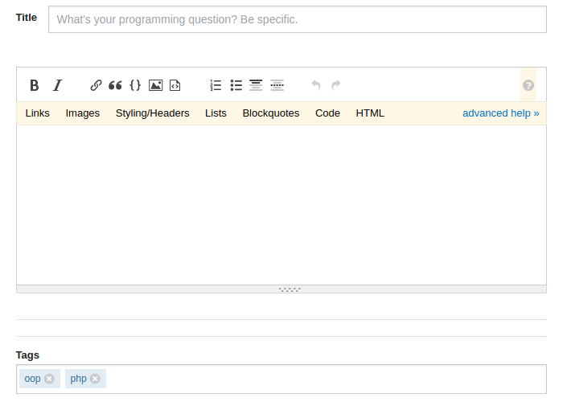

# Dare it for Technorio Internship

> 

## PHP Developer

#### Problem

* Create a blog portal to post articles.
* The article must include a title, its content and the tags category to be posted. 
* *Each post may contain one or multiple categories. And tag may be contained by many posts*
* The user must be able to navigate posts with corresponding tags and vice versa.

References of StackOverflow:

**Important** - Bitbucket private repository name must be `technorio-php-back`

#### Judging Criteria:

* Object Oriented Approach
* Form Validation
* Database Schema (Don't forget to upload `.sql` file)
* Folder Structure

#### Plus Points:

* Implemented concept of MVC.
* Use of any frameworks like Codeigniter, Laravel.
* Well documented.
* Followed [PSR-0, PSR-1, PSR-2, PSR-4](https://gist.github.com/exanup/709e9b24414d9bba1ea64a14844f1f1f)
